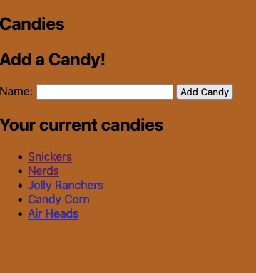
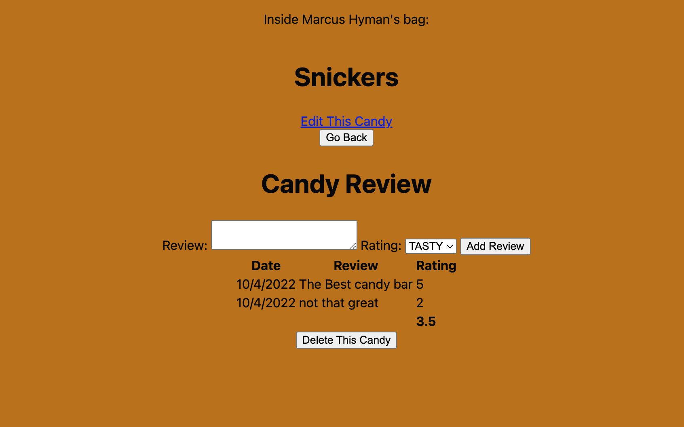

# Candy Collector

## Halloween is almost here. Wouldn't it be great if you had a way to keep track of what is in your candy bag this year? 

## Screenshot 1

## Screenshot 2

## Deployment link

[Delploy Link](https://candy-collector.fly.dev)

 ## Planning Materials

[Trello & ERD](https://trello.com/b/YVNNTyrw/candy-collector)

## Technologies Used

Javascript, HTML, CSS, Azure, Google OAUTH, favicon.io 

## Ice Box

I would like to give users an option to favorite a piece of candy.

I would like to implent a trade feature.

I would like to let users see what candies are the most popular. 

I would like to implement mobile funtionality.